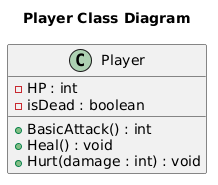
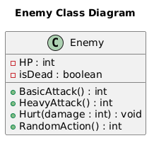
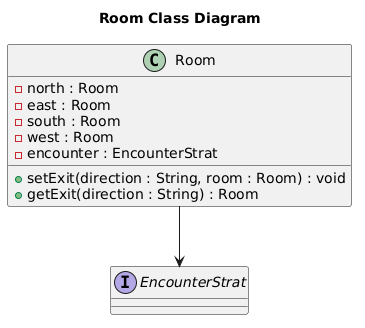
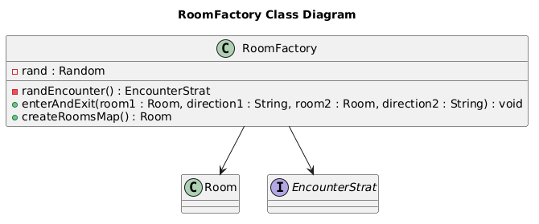
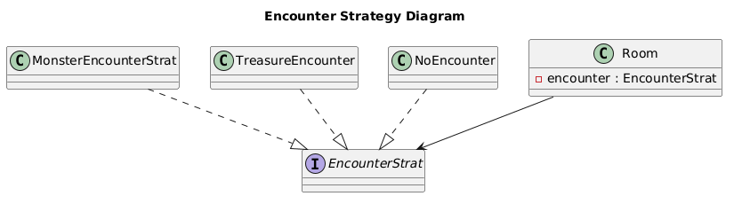
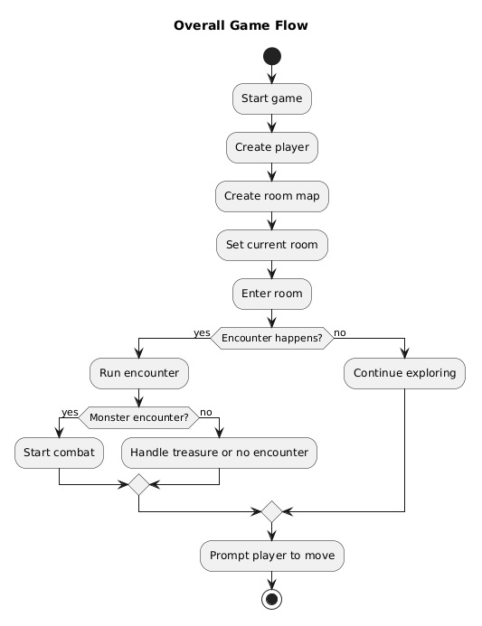
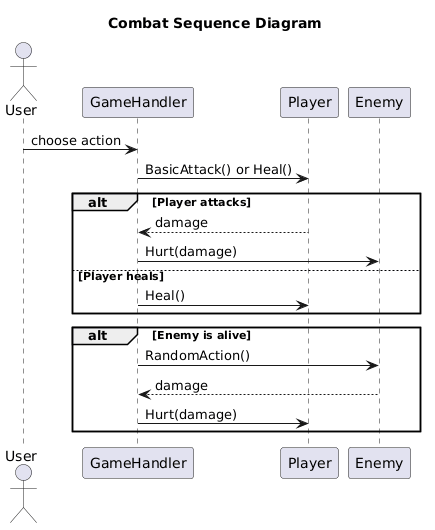
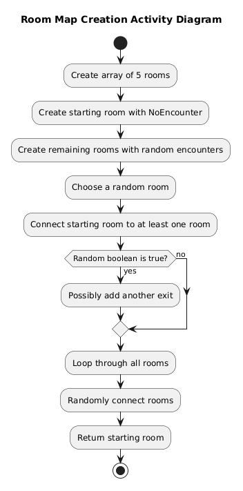
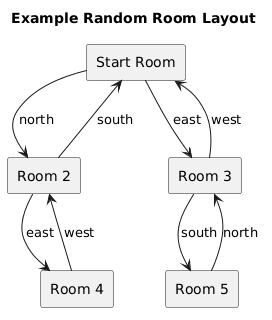

## Goober Gaming Architecture Diagrams

## System Diagrams

The following diagrams are included to explain how the game works. 
They show the main parts of the program, how the rooms are created, what happens in each room, and how the game runs step-by-step.

## Diagram 1: High Level Class Diagram

This diagram shows the main classes in the RPG systm and how they relate to each other. 

---

## Diagram 2: Player Class Diagram

This diagram shows the fields and methods used in Player class.

---

## Diagram 3: Enemy Class Diagram

This diagram shows the fields and methods used in the Enemy class. 

---

## Diagram 4: Room Class Diagram

This diagram shows each room stores exits and encounter strategy.

---

## Diagram 5: RoomFactory Class Diagram

This diagram shows the methods responsible for randomly creating and connecting rooms.

---

## Diagram 6: Encounter Strategy Diagram

This diagram shows how the game uses different encounter strategy classes inside each room. 

---

## Diagram 7: Overall Game Flow Activity Diagram

This activity diagram shows the main flow of the game from startup to exploration and encounters. 

---

## Diagram 8: Combat Sequence Diagram

This sequence diagram shows the order of actions during combat between the player and enemy. 

---

## Diagram 9: Room Map Creation Activity Diagram

This diagram shows the steps used by RoomFactory to generate the room map. 

---

## Diagram 10: Example Room Layout Diagram

This diagram shows one possibe room layout. Since the map is randomly generated, the actual layout may be different each time. 

