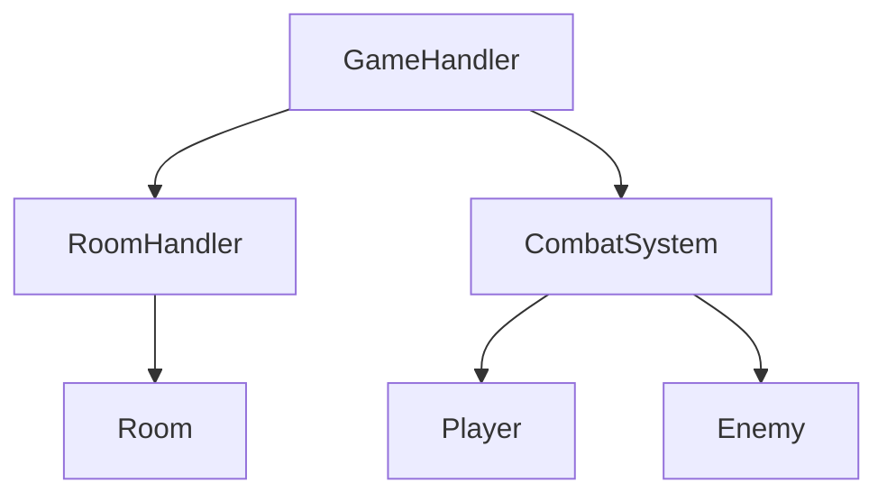
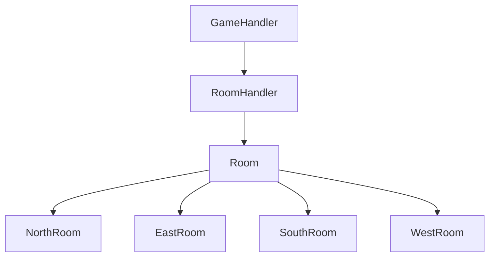
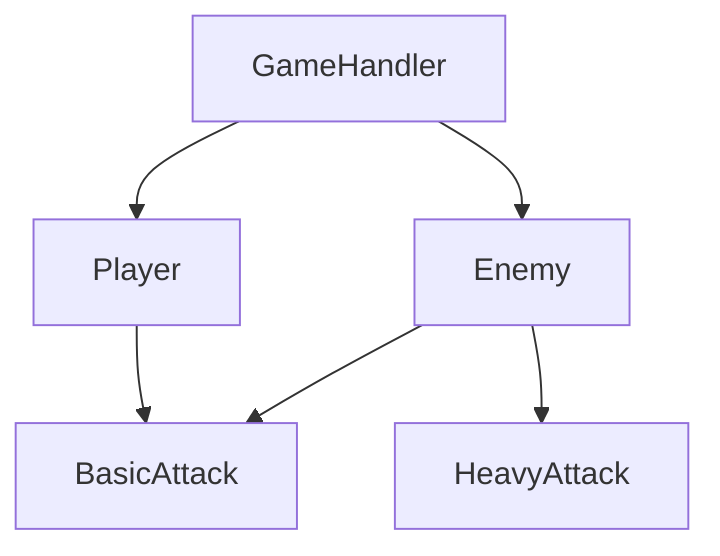

# Goober Gaming OO Design

## Introduction

This is a simple turn-based battle-adventure game. The player moves through rooms and fights enemies.  
The game has different parts to handle movement, fighting, and game rules.

We use some design patterns to make the game easier to manage and change.

---

## Current Patterns We Use

**Prototype Pattern**

We use Prototype to copy objects like `Player` and `Enemy` instead of making them from scratch.  
This makes it easy to create more enemies or reset characters.

**Strategy Pattern**

The enemy can attack in different ways.  
It can do a basic attack or a heavy attack. The Strategy pattern helps pick which attack to use.

**Template Method Pattern**

The game loop in `GameHandler` is the same every turn:  
1. Show player and room info  
2. Get player input  
3. Move player  
4. Fight if needed  

This pattern keeps the turn order consistent but lets attacks and actions be flexible.

**Room Navigation**

Rooms are linked using north, east, south, and west.  
`RoomHandler` manages the current room and checks if the player can move.  
If the player enters a new room that has not had an encounter, a fight happens.

---

## Potential Future Patterns

| Pattern | How it could help |
|-------|-----------------|
| Factory | Make different enemies easily |
| Observer | Update UI or logs when HP changes |
| Decorator | Add effects like buffs or **sound effects** |
| Command | Represent actions like attack or heal as objects |
| Singleton | Keep track of game state or manage sounds |

**Sound Effects Idea**

- We could use the Decorator pattern to add sounds to attacks or healing.  
- Example: When `Player` attacks, a swing sound plays.  
- This can be added without changing the main attack code.

---

## How the Game Parts Work

### Player

- Has `hp` (max 10)  
- Has `isDead`  
- Can do `basicAttack()` (damage 1-3)  
- Can `heal()` (gain 3 hp, max 10)  
- Can `hurt(damage)` (lose hp, die if hp <= 0)

### Enemy

- Has `hp` (max 10)  
- Has `isDead`  
- Can do `basicAttack()` (damage 1-3)  
- Can do `heavyAttack()` (damage 4-5)  
- Can do `randomAction()` (choose attack, heavy attack chance ≤ 1/3)  
- Can `hurt(damage)` (lose hp, die if hp <= 0)

### Room

- Has `ranEncounter` (true if fight already happened)  
- Has `north`, `east`, `south`, `west` (links to other rooms, can be null)  
- `setExit(direction, room)` sets the room in that direction

### RoomHandler

- Keeps track of `currentRoom`  
- `createMap()` makes rooms and links them together  
- `changeRoom(direction)` moves the player if the room exists, returns true or false

### GameHandler

- `run()` handles moving the player and starting fights  
- `runEncounter()` handles combat between player and enemy

---

## System Diagrams

**High-Level Architecture**

**Room Navigation**

**Combat System**

---

## Summary

The game is split into parts for player, enemy, rooms, navigation, and combat.  
Prototype, Strategy, and Template Method patterns help keep it organized.  
Other patterns like Factory, Decorator, and Observer could make it even better.  
Adding sounds and extra effects is also possible in the future.
